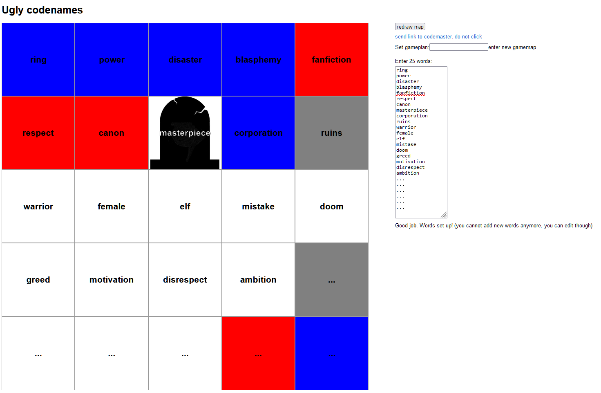

# Ugly codenames

Minimalistic implementation of codenames. You can write your own words and enjoy your special flavor of game. Meant to be played with one main shared screen and one additional device with codemaster view. Assumes good intentions from all players.

## Instructions
1. write your own words
2. share main screen with all players
3. send secret link with current gameplan to codemasters.
4. more detailed instructions at the bottom of the screen

hosted: http://michalkeda.com/uglycodenames

## disclaimer
This was written as a learning exercise for reactjs, typescript and some other front-end technologies.